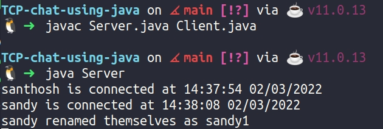
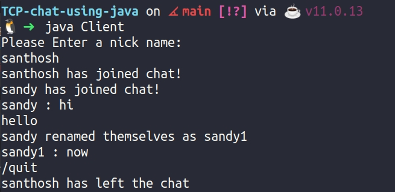
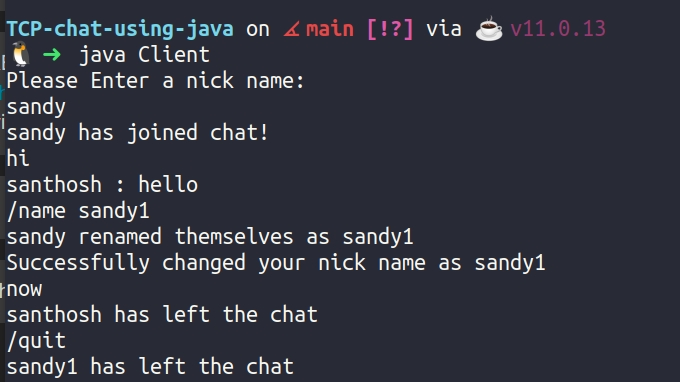

# This is a simple Chat application in terminal using java

## To use the application

- clone the repository
- Run the Client if you want to connect to some other server `java Client 192.168.54.32`
- If you wanna connect to multiple devices in the same network,
  1. `java Server`
  2. `java client`

**Commands**

1. `/name` 'To change nick name
2. `/quit` To quit chat

---

---

